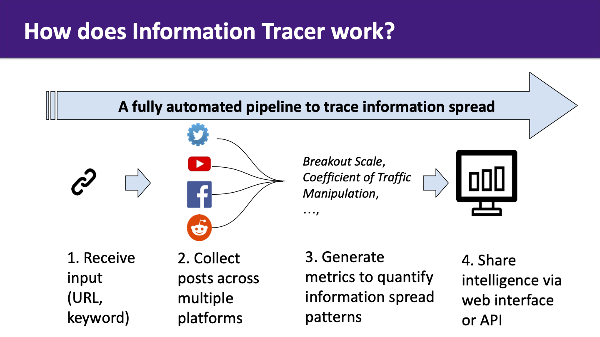
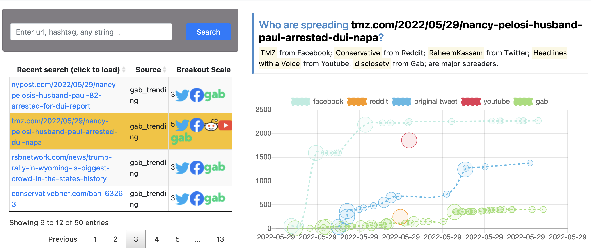

Information Tracer API Python library
----------------------------

### Who we are
- [Information Tracer](https://informationtracer.com) provides cross-platform social media intelligence about how information (URL, keyword, hashtag) spreads online. 
- Some features: search any keyword during any time period; get top posts per platform; visualize sharing network; access indicators of suspicious behaviors. 
- We currently cover 5 platforms -- Twitter, Facebook, Reddit, Youtube and Instagram.
- Below is a diagram of our system design. To learn more please check [our paper](http://ceur-ws.org/Vol-2890/paper3.pdf) 




### Pre-requisite 
- python 3
- you must already have a token, contact us to get a token


### Overview our three main API endpoins
1. Use Submit API to submit a query, and get a unique identifier called `id_hash256`
2. Use Status API to check status of a running query, based on `id_hash256`
3. Use Result API to get full result of a query, based on `id_hash256`
4. For an end-to-end functional code, please see `example.py`

### Submit API
Input: `query`, `token`, `start_date`, `end_date`
Output: `id_hash256` (a unique string identifier for this search)

Example:
```python
import requests
SUBMIT_URL = 'https://informationtracer.com/submit'

query = 'nvidia AND scam'
token = 'YOUR_TOKEN'
start_date = '2023-11-03'
end_date = '2023-11-08'

response = requests.post(SUBMIT_URL, 
                             timeout=10,
                             json={'query': query, 
                                   'token': token,
                                   'start_date': start_date,
                                   'end_date': end_date,
                                   }                                   
                            )
if 'id_hash256' in response.json():
    id_hash256 = response.json()['id_hash256']
```


### Status API (get status of a running query and partial result (top 5 tweets). must have id_hash256)
Input: `id_hash256`, `token`, `include_partial_results` (either '0' and '1')
Output: json (detail below)

Example:
```python
import requests
STATUS_URL = 'https://informationtracer.com/status'

url = "{}?token={}&id_hash256={}&include_partial_results={}".format(STATUS_URL, token, id_hash256, 0)
results = requests.get("url").json()
```

#### Format of output
When `include_partial_results` is set to '0', or there is no partial result.
```
{'status': 'started', 
 'status_percentage': '10', 
 'status_text': 'Collecting cross-platform posts...', 
 'tweet_preview': None
}
```

When `include_partial_results` is set to '1', and there is partial result (by default, the system returns the top 5 tweets by retweet). 

`tweet_preview` is a list of json. Please check the Result API for a full explanation of each json key (`d`, `i`, `l`, ...).
```
{'status': 'started', 
 'status_percentage': '10', 
 'status_text': 'Collecting cross-platform posts...', 
 'tweet_preview': [{'d': '@Apple Unless you buy a MacBook circa 2010',
                    'i': 0, 
                    'l': 'https://twitter.com/heathdollars/status/1721998289388896312', 'n': 'heathdollars', 
                    'p': 'https://pbs.twimg.com/profile_images/1641987731181142018/tECQ8Xy1_normal.jpg', 
                    't': '2023-11-07T21:09:20', 
                    'u_d': 'join your union\n\nhttps://t.co/4sxV02E2aI', 
                    'u_id': '1000720137106866176', 
                    'u_t': '2018-05-27T12:47:27'
                    }, 
                    {...}, 
                    {...}, 
                    ...
                   ]
}
```


### Result API (get full results. must have id_hash256)
Input: `id_hash256`, `token`
Output: json (detail below)
```python
import requests
RESULT_URL = 'https://informationtracer.com/result'

url = "{}?token={}&id_hash256={}".format(RESULT_URL, token, id_hash256)
results = requests.get("url").json()
```

#### Format of output 
The returned data is in json format, with the following fields

- `query`: the search query 
- `created_at`: time the search query is submitted
- `id_hash256`: unique ID (identifier) for this query
- `posts`: social media posts on each platform. Each post has four parameters:
  - `d`: description, basically the text
  - `i`: number of interaction
  - `n`: name of the account/group/channel
  - `t`: time of the post (timezone is UTC, example format: "2021-01-16T07:16:31")
  - `p`: profile (a URL that points to an image); for youtube, its the video thumbnail
  - `u_id`: Twitter user id (ONLY AVAILABLE for TWITTER)
  - `u_d`: Twitter user description (ONLY AVAILABLE for TWITTER)
  - `u_t`: Twitter user account creation time (ONLY AVAILABLE for TWITTER)

- `metric`: summary statistics, such as average post per twitter user
- `indicator_of_coordination`: indicators of coordinated behavior, derived from different metrics, posts and spread patterns
- `summary`: summary of major posts on each platform, generated by ChatGPT
- `sentiment`: overall sentiment (Positive, Negative, Mixed, N/A) on each platform, generated by ChatGPT
- `interaction`: total engagement on each platform
- `co_occurrence`: list of urls and hashtags that appear together with the query
- `breakout_moment`: list of events during which the Twitter engagement broke out

```
{
    "query": "Sample query",
    "metric": {
        'facebook': {
            'avg_post_per_user': 1.34,
            'percent_post_from_top_10_percent_user': 30.0,
            'top_10_user': [
                'Risala Update',
                'Scottish Jews Against Zionism',
                'United 4 Julian Assange',
                'ডা. মনীষা চক্রবর্ত্তী',
                ...
                              ]},
        'instagram': {
            'avg_post_per_user': 1.32,
            'percent_post_from_top_10_percent_user': 27.2,
            'top_10_user': [
                'Sally hates capitalism',
                'Abraham Josephine Riesman'
                ]},
        'twitter': {
            'avg_post_per_user': 1.44,
            'percent_post_from_top_10_percent_user': 33.4,
            'top_10_user': [
                'TorahJudaism',
                'REVMAXXING',
                'ShaykhSulaiman',
                ]}
    },
    "posts": {
        "facebook": [
            {
                "d": "None",
                "i": 99,
                "n": "Objectv Media",
                "t": "2021-01-16T07:16:31",
                "p": "https://...."
            },
            {
                "d": "None",
                "i": 33,
                "n": "Who to Vote Nigeria",
                "t": "2021-03-12T21:05:02",
                "p": "https://...."
            },
        ],
        "reddit": [],
        "twitter": [
            {
                "d": "@haidaer__ \ud83e\udd14",
                "i": 0,
                "n": "ebikhay",
                "t": "2022-05-14T08:48:16",
                "p": "https://...."
            },
        ],        
        "youtube": []
    },
    "co_occurrence": [
    {
        "count": 54,
        "name": "URL_ABC",
        "platform": "facebook",
        "type": "url"
    },
    {
        "count": 44,
        "name": "HASHTAG_XYZ",
        "platform": "twitter",
        "type": "hashtag"
    }],
    "indicator_of_coordination": {
        'coordination_score': 0,
        'frequent_posters_facebook': {
            'context': '...',
            'verdict': False
        },
        'frequent_posters_instagram': {
            'context': '...',
            'verdict': False
        },
        'frequent_posters_twitter': {
            'context': '...',
            'verdict': False
        },
        'twitter_new_account_percent': {
            'context': 'Percent of twitter account created after 2021 is 28. This is within normal range...',
            'verdict': False
        }
    },
    "interaction": {
        'facebook': 547897,
        'instagram': 477914,
        'reddit': 18053,
        'twitter': 1407268,
        'youtube': 80160
    },
    "summary" : {
        'facebook': 'Summary: The posts contain a mix of opinions regarding ...',
        'instagram': 'ummary: The posts express a ...',
        'reddit': 'The overall sentiment is Mixed. Because...',
        'twitter': '...',
        'youtube': '...'
    },
    "sentiment": {
        'facebook': 'Mixed',
        'instagram': 'Mixed',
        'reddit': 'Mixed',
        'twitter': 'Mixed',
        'youtube': 'Mixed'
     },
    "breakout_moment": [
        {'height': 10.453914959499867,
         'summary': 'The key event from the tweets is that...'
    }],
    "id_hash256": "a21c353de8b231a458b88db0ee8f483ccd2b38482d82f3556b443b2071cec819",
    "created_at": "Mon, 23 Jan 2023 12:26:55 GMT",
}
```

### Additional API -- Load Source (get detailed posts from a particular platform)
```python
import requests
url = "https://informationtracer.com/loadsource?source={}&id_hash256={}&token={}".format(SOURCE, id_hash256, YOUR_TOKEN)
results = requests.get(url).json()
```

### Web interace 
- To help people visualize the information, we provide a web interface available at [https://informationtracer.com](https://informationtracer.com). 
- To visualize a query you searched recently, you can visit `https://informationtracer.com/?result={id_hash256}`. 
- Log in is required. Please contact us and we will help you register an account



### Tips on how to build advanced search query
#### Important rules
- `AND`, `OR`, `NOT` must be all-cap. Otherwise they are treated as normal English words
- Use parenthesis to group multiple words with AND. For example, `(Word1 AND Word2)`
- Query limit is 512 characters. Sending a query above the limit might get empty results.

Example: `(Ukraine AND NATO) OR (Ukraine AND EU)`
Meaning: Any posts that contain "Ukraine" and "NATO" or "Ukraine" and "EU".

Example: `(Ukraine AND NATO) NOT Putin`
Meaning: Any posts that contain "Ukraine" and "NATO", without word "Putin".

### Contact / Bug Report
For bug report or any inquiry, please contact Zhouhan Chen zhouhan@safelink.network


### Media coverage
- [Information Tracer, a proactive framework to fight COVID-19 infodemic](https://nyudatascience.medium.com/cds-guest-editorial-information-tracer-a-proactive-framework-to-fight-covid-19-infodemic-3f9766936f94)
- [NYC Media Lab Announces Inaugural Cohort of AI & Local News Challenge](https://www.nycmedialab.org/ai-local-news-blog-update/nyc-media-lab-announces-inaugural-cohort-of-ai-amp-local-news-challenge) 


